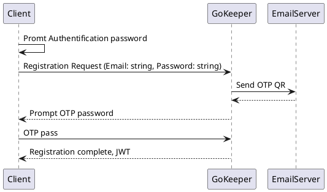
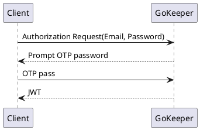
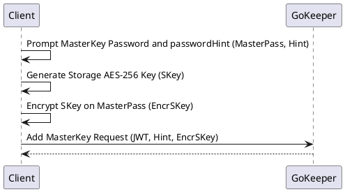

# gophkeeper - Yandex Practicum graduation project

## iteration1 - authirization

Client <-> Server:
- gRPC interaction  (based on tls, CA authority -> Server cert, start client with CA certificate)
- registration
- authorization (OTP)
- authentfication (JWT)
- TUI

Refs:
[AES-256 key encryption](https://github.com/andrewromanenco/gcrypt)

### Registration

prview в VSCode - Alt-D.

### Authorization

### MasterKey Generation

