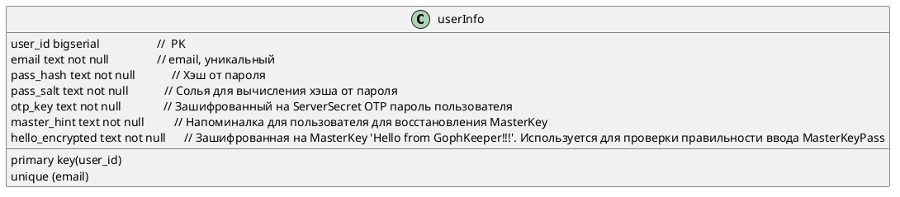

# ADR 003

## Структура базы данных
- статус: proposed
- 2024-07-17

## Контекст
В базе данных содержится только постоянная информация.

## Принятое решение  (Alt-D)

## Ссылки

[https://habr.com/ru/articles/747348/](https://habr.com/ru/articles/747348/)